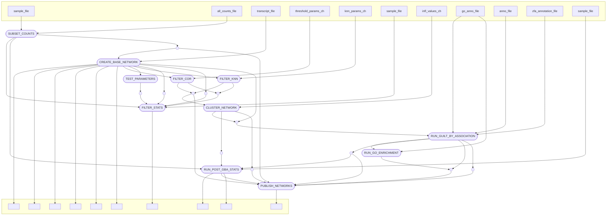

# ZMP Network

## Processes

### LOG_INFO

Prints out some information about input files and settings. Only run if
the debug param is greater than 0. Executed locally.

### SUBSET_COUNTS

Creates a sample and count file for each individual experiment with the
counts aggregated to the gene level.

Inputs:

1.  Samples file: Tab-separated file, must contain columns `expt` and
    `sample`

2.  Counts file: Comma-separated file containing counts for all the
    samples (Can be gzipped)

Outputs:

1.  expts_file: File containing expt directory names

2.  sample_files: Tuple of sample files

3.  count_files: Tuple of count files

These are processed to create Tuples containing expt name, sample file
and count file for `CREATE_BASE_NETWORK`.

Script: Runs `subset-by-expt.sh` which in turn runs `subset-by-expt.py`

### CREATE_BASE_NETWORK

Creates a base correlation network containing ALL edges and one with
edge weights converted to absolute values and edges with weights less
than 0.2 discarded. It also removes genes that lead to spurious high
correlations due to large numbers of zeros values.

Inputs:

1.  Tuple of expt name, sample file and count file

2.  Path to the transcripts file (needed to convert counts to TPM)

Outputs:

1.  sample_files: Tuple of experiment name and samples file paths.

2.  tpms_file: Tuple of experiment name and TPM file path.

3.  tab_file: Tuple of experiment name and MCL file mapping node ids to
    gene ids.

4.  base_network: Tuple of experiment name and MCL network (binary) file
    detailing all the edges in the network and their weights.

5.  filtered_tpms_file: Tuple of experiment name and TPM file filtered
    by zeros

6.  no_all_zeros_tpms_file: Tuple of experiment name and TPM file with
    genes where all values are zero removed

7.  filtered_tab_file: Tuple of experiment name and MCL tab file for the
    TPM file filtered by zeros

8.  filtered_network: Tuple of experiment name and MCL network (binary)
    file creating from the filtered_tpms_file

9.  filtered_t20_network: Tuple of experiment name and MCL network
    (binary) file with absolute edge weights. Edges with weights less
    than 0.2 have been removed.

10. cor_hist: path to file containing counts of edges with correlation
    values in 0.1 width bins

11. filtered_cor_hist: same as cor_hist for filtered network

Script: Runs `counts-to-fpkm-tpm.R` and then `mcxarray`, `mcx query` and
`mcx alter`

### TEST_PARAMETERS

Collects stats on node degree and singletons when the correlation
threshold is varied. Also collects stats on filtering using k-nearest
neighbours. Uses the `filtered_t20_network` output channel from
`CREATE_BASE_NETWORK` as input.

Inputs:

1.  Tuple of expt name and MCX file path

Outputs:

1.  vary_threshold_stats: Tuple of paths to the stats output files from
    `mcx query`

Script: Runs `mcx query`

### FILTER_COR

Using the threshold parameters to create pruned networks. Uses the
`filtered_network` output channel from `CREATE_BASE_NETWORK` as input.

Inputs:

1.  Tuple of expt name and MCX file path

2.  Threshold parameter

Outputs:

1.  filtered_mcx: Tuple of expt name and path to filtered MCX file

2.  node_stats: Stats file for filtered network

Script: Runs `mcx alter` and `mcx query`

### FILTER_KNN

Using the knn parameters to create pruned networks. Uses the
`filtered_network` output channel from `CREATE_BASE_NETWORK` as input.

Inputs:

1.  Tuple of expt name and MCX file path

2.  Threshold parameter

Outputs:

1.  filtered_mcx: Tuple of expt name and path to filtered MCX file

2.  node_stats: Stats file for filtered network

Script: Runs `mcx alter` and `mcx query`

### CLUSTER_NETWORK

Clusters the supplied network.

Inputs:

1.  Tuple of expt name and MCX file path

2.  Inflation values: From `inflationParams` in the config. This is a
    list. The CLUSTER process is run once for each inflation value in
    the list.

Outputs:

1.  clustering: Tuple of expt name. MCX file and clustered MCX file

2.  cluster_sizes: File of cluster ids and sizes (i.e. number of nodes)

3.  stats: Stats file and info file

Script: Runs `mcl`, `clm info` and `summarise_clustering.py`

### RUN_GUILT_BY_ASSOCIATION

Converts the clustered MCI file to nodes and edges files. Then runs GBA
on the network.

Inputs:

1.  Tuple of expt name, tab file, MCX file, Cluster file

2.  Annotation file: Tab-separated file of Gene annotation (Chr, Start
    End, ID, Name etc.)

3.  GO annotation file: Tab-separated file of GO annotation (GeneID,
    TermID, Component)

4.  ZFA annotation file: Tab-separated file of ZFA annotation (GeneID,
    TermID)

Outputs:

1.  graph_files: Tuple of cluster file, graphml files, nodes file and
    edges file

    1.  MCX Cluster file

    2.  Graphml file: For importing into Cytoscape etc.

    3.  Nodes file: Comma-separated file of node information with Name
        and Cluster id

    4.  Edges files: Comma-separated file of edge information with
        source, target and weight

2.  auc_files: Files with AUC values for each term from GO and ZFA
    ontologies

3.  gba_out: Tuple of

    1.  GBA output: Output file from GBA with gene scores for each GO
        term

    2.  Plots file: Histograms of AUC values

Script: Runs `mcx convert`, `convert_mcl.py` and `run-GBA-network.R`

### RUN_POST_GBA_STATS

Analyses the effect of different thresholds and clustering parameters on
the quality of the network/clusters

Inputs:

1.  Expts file: The `expts_file` output channel from `SUBSET_COUNTS`

2.  Samples file: Tab-separated file, must contain columns `expt` and
    `sample`

3.  auc_files: Files with AUC values for each term from GO and ZFA
    ontologies `auc_files_ch` output channel from
    `RUN_GUILT_BY_ASSOCIATION`

4.  cluster_sizes: Cluster sizes files. `cluster_sizes` output channel
    from `CLUSTER_NETWORK`

Outputs:

1.  plots: paths to output plots

2.  tsv: Tab-separated output files. Contain values for the ecdf
    (empirical cumulative density function) cluster sizes

3.  html: html output showing % of nodes in each network of sizes
    between 100 and 1000

### ENRICHMENT

Runs topGO enrichment on the individual clusters in the network

Inputs:

1.  `graph_files` output channel from `RUN_GUILT_BY_ASSOCIATION`. Tuple
    of

    1.  Clustered MCI file

    2.  Graphml file

    3.  Nodes file

    4.  Edge file

2.  GO annotation file. `go_anno_file` output channel from
    `GET_ANNO_GET_GO_ANNO`

Outputs:

1.  go_output: Tuple of

    1.  Cluster File

    2.  topGO output directory

Script: Runs `create_files_for_topgo.py` and `run_topgo.pl`

### PUBLISH_NETWORKS

Takes all of the output files and runs a python script to pick the best
clustering for that experiment and publish just those files.

Inputs:

1.  Expts: Tuple of

    1.  Expt name

    2.  Filter method (cor or knn)

2.  ecdf tsv files: `tsv` output channel from RUN_POST_GBA_STATS

3.  MCX files: `filtered_network_ch`

4.  Stats files: network stats files

5.  Graph files: graphs and GO output

6.  AUC files:

7.  GBA output files

Outputs:

1.  pub_files: The files to publish. Organised into one directory for
    each experiment

## Process DAG

