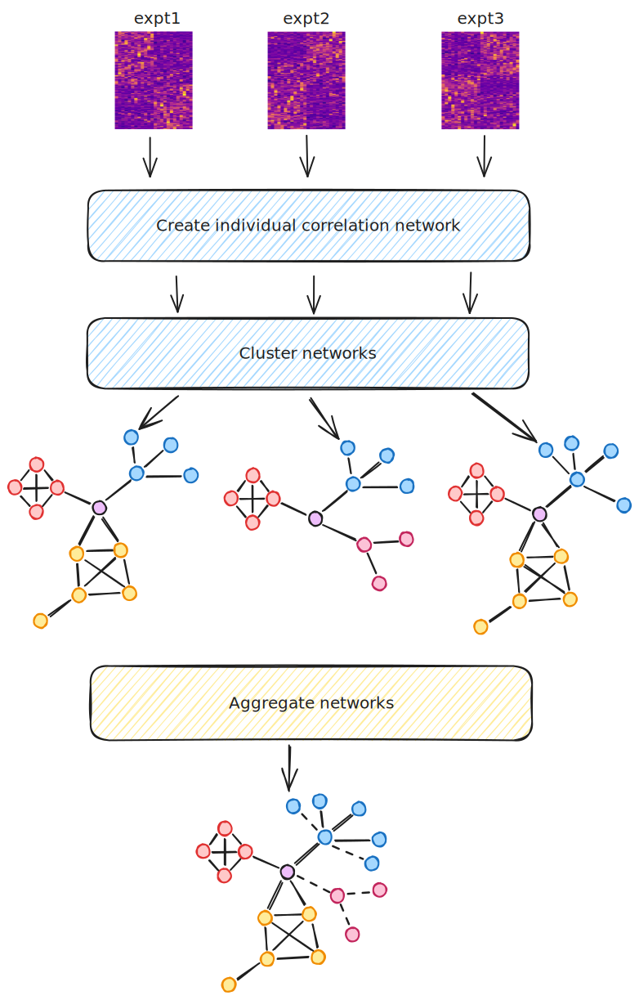
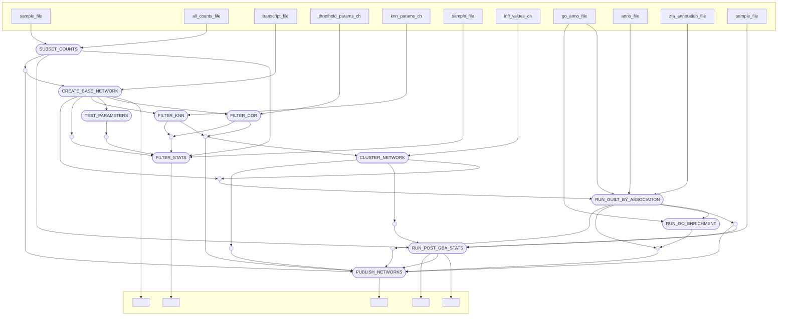

# ZMP Network

## Processes

### SUBSET (big_mem_retry)

Creates a sample and count file for each individual experiment with the
counts aggregated to the gene level.

Inputs:

1.  Experiment file: Tab-separated file, containing columns `expt` and
    `sample`

2.  Counts file: Comma-separated file containing counts for all the
    samples (Can be gzipped)

Outputs: Tuple of  
1. File containing expt directory names

1.  Tuple of sample files

2.  Tuple of count files

These are process to create Tuples containing and expt name, sample file
and count file for `CREATE_BASE_NETWORK`.

Script: Runs `scripts/subset-by-expt.py`

### CREATE_BASE_NETWORK (big_mem_retry)

Creates a base correlation network containing ALL edges and one with
edge weights converted to absolute values and edges with weights less
than 0.2 descarded.

Inputs:

1.  Expt name

2.  sample file

3.  count file

Outputs:

1.  Dir name: name of experiment.

2.  TPM file: Tab-separated file of TPMs used to create the network.

3.  TAB file: File output by MCL mapping node ids to gene ids.

4.  MCX file: MCL network (binary) file detailing all the edges in the
    network and their weights.

5.  t20 MCX file: MCL network (binary) file with absolute edge weights.
    Edges with weights less than 0.2 have been removed.

6.  MAT file: Gzipped file containing all edge weights in a matrix
    format.

7.  Cor hist file: contains counts of edges with correlation values in
    0.1 width bins

Script: Runs `scripts/counts-to-fpkm-tpm.R` and then `mcxarray`,
`mcxdump` and `cor-hist.py`

### TEST_PARAMETERS (med_mem_retry)

Creates a basic network thresholded at 0.2 and then collects stats on
node degree and singletons when the threshold is varied. Also collects
stats on using k-nearest neighbours.

Inputs:

1.  Dir name: name of experiment

2.  TPM file: Tab-separated file of TPMs used to create the network

Outputs:

1.  Dir name: name of experiment

2.  MCI file: MCL network file detailing all the edges in the network
    and their weights.

3.  Cor stats file: File of node stats varying correlation threshold

4.  Knn stats file: File of node stats varying knn threshold

Script: Runs `mcxarray` and `mcx query`

### FILTER_COR (retry)

Using the threshold parameters to create pruned networks.

Inputs:

1.  Dir name: name of experiment

2.  MCI file: MCL network file detailing all the edges in the network
    and their correlation values

3.  Threshold parameter

Outputs:

1.  Dir name: name of experiment

2.  MCI file: MCL network files pruned using correlation threshold.

3.  Stats file

Script: Runs `mcx alter` and `mcx query`

### FILTER_KNN (retry)

Using the knn parameters to create pruned networks.

Inputs:

1.  Dir name: name of experiment

2.  MCI file: MCL network file detailing all the edges in the network
    and their correlation values

3.  knn parameter

Outputs:

1.  Dir name: name of experiment

2.  MCI file: MCL network files pruned using correlation threshold.

3.  Stats file

Script: Runs `mcx alter` and `mcx query`

### CLUSTER (retry)

Clusters the supplied network.

Inputs:

1.  Tuple of

    1.  Dir name: name of experiment

    2.  Threshold string

    3.  MCI file

2.  Inflation values: From `inflationParams` in the config. This is a
    list. The CLUSTER process is run once for each inflation value in
    the list.

Outputs:

Tuple of

1.  Dir name: name of experiment

2.  MCI file

3.  Clustered MCI file

4.  Stats file: info on each node

5.  Tuple of summarise_clustering.py outputs (cluster sizes and
    histograms)

The outputs are crossed with the output from CREATE_BASE_NETWORK and
rearranged so that the original tab file is available for the next
process (GBA)

Script: Runs `mcl`, `clm info` and `scripts/summarise_clustering.py`

### GBA (huge_mem_retry)

Converts the clustered MCI file to nodes and edges files. Then runs GBA
on the network.

Inputs:

1.  Tuple of:

    1.  Dir name: name of experiment

    2.  TAB file

    3.  MCI file

    4.  Clustered MCI file

2.  Annotation file: Tab-separated file of Gene annotation (Chr, Start
    End, ID, Name etc.)

3.  GO annotation file: Tab-separated file of GO annotation (GeneID,
    TermID, Component)

4.  ZFA annotation file: Tab-separated file of ZFA annotation (GeneID,
    TermID)

Outputs:

Tuple of

1.  Dir name: name of experiment

2.  Clustered MCI file

3.  Graphml file: For importing into Cytoscape etc.

4.  Nodes file: Comma-separated file of node information with Name and
    Cluster id

5.  Edges files: Comma-separated file of edge information with source,
    target and weight

6.  AUC file: Output file from GBA with AUC values for each GO term

7.  Gene scores file: Output file from GBA with gene scores for each GO
    term

8.  Plots file: Histograms of AUC values

Script: Runs `scripts/mcl2nodes-edges.py` and
`scripts/run-GBA-network.R`

### ENRICHMENT (retry)

Runs topGO enrichment on the individual clusters in the network

Inputs:

1.  Tuple of

    1.  Dir name

    2.  Clustered MCI file

    3.  Nodes file

2.  GO annotation file

    output: tuple val(dir), path(nodes_file), path(“*/GO/*”)

Outputs:

Tuple of

1.  Dir name

2.  Nodes file

3.  Tuple of GO enrichment files

Script: Runs `create_files_for_topgo.py` and `run_topgo.pl`
