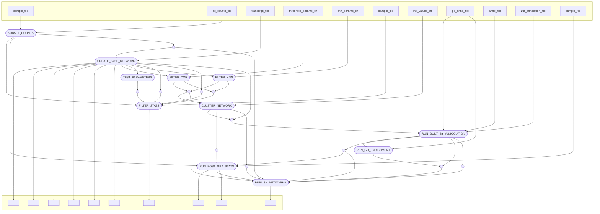

```mermaid
flowchart TB
    subgraph " "
    v0["sample_file"]
    v1["all_counts_file"]
    v8["transcript_file"]
    v17["threshold_params_ch"]
    v19["knn_params_ch"]
    v27["sample_file"]
    v30["infl_values_ch"]
    v33["go_anno_file"]
    v34["anno_file"]
    v35["zfa_annotation_file"]
    v39["sample_file"]
    end
    v2([SUBSET_COUNTS])
    v9([CREATE_BASE_NETWORK])
    subgraph " "
    v10[" "]
    v11[" "]
    v12[" "]
    v13[" "]
    v14[" "]
    v15[" "]
    v29[" "]
    v41[" "]
    v42[" "]
    v58[" "]
    end
    v16([TEST_PARAMETERS])
    v18([FILTER_COR])
    v20([FILTER_KNN])
    v28([FILTER_STATS])
    v31([CLUSTER_NETWORK])
    v36([RUN_GUILT_BY_ASSOCIATION])
    v40([RUN_POST_GBA_STATS])
    v43([RUN_GO_ENRICHMENT])
    v57([PUBLISH_NETWORKS])
    v3(( ))
    v21(( ))
    v22(( ))
    v24(( ))
    v25(( ))
    v26(( ))
    v32(( ))
    v37(( ))
    v38(( ))
    v46(( ))
    v48(( ))
    v55(( ))
    v0 --> v2
    v1 --> v2
    v2 --> v28
    v2 --> v40
    v2 --> v3
    v8 --> v9
    v3 --> v9
    v9 --> v15
    v9 --> v14
    v9 --> v13
    v9 --> v12
    v9 --> v11
    v9 --> v10
    v9 --> v18
    v9 --> v16
    v9 --> v20
    v9 --> v24
    v9 --> v25
    v9 --> v32
    v16 --> v26
    v17 --> v18
    v18 --> v21
    v18 --> v22
    v19 --> v20
    v20 --> v21
    v20 --> v22
    v27 --> v28
    v22 --> v28
    v24 --> v28
    v25 --> v28
    v26 --> v28
    v28 --> v29
    v30 --> v31
    v21 --> v31
    v31 --> v32
    v31 --> v38
    v31 --> v46
    v33 --> v36
    v33 --> v43
    v34 --> v36
    v35 --> v36
    v32 --> v36
    v36 --> v43
    v36 --> v37
    v36 --> v48
    v36 --> v55
    v39 --> v40
    v37 --> v40
    v38 --> v40
    v40 --> v42
    v40 --> v57
    v40 --> v41
    v43 --> v48
    v3 --> v57
    v21 --> v57
    v37 --> v57
    v46 --> v57
    v48 --> v57
    v55 --> v57
    v57 --> v58
```
