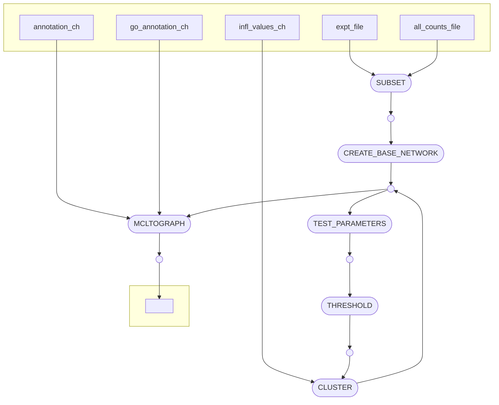

```mermaid
flowchart TB
    subgraph " "
    v0["expt_file"]
    v1["all_counts_file"]
    v15["infl_values_ch"]
    v21["annotation_ch"]
    v22["go_annotation_ch"]
    end
    v2([SUBSET])
    v5([CREATE_BASE_NETWORK])
    v9([TEST_PARAMETERS])
    v12([THRESHOLD])
    v16([CLUSTER])
    v23([MCLTOGRAPH])
    subgraph " "
    v25[" "]
    end
    v3(( ))
    v6(( ))
    v10(( ))
    v13(( ))
    v24(( ))
    v0 --> v2
    v1 --> v2
    v2 --> v3
    v3 --> v5
    v5 --> v6
    v6 --> v9
    v9 --> v10
    v10 --> v12
    v12 --> v13
    v15 --> v16
    v13 --> v16
    v16 --> v6
    v21 --> v23
    v22 --> v23
    v6 --> v23
    v23 --> v24
    v24 --> v25
```
