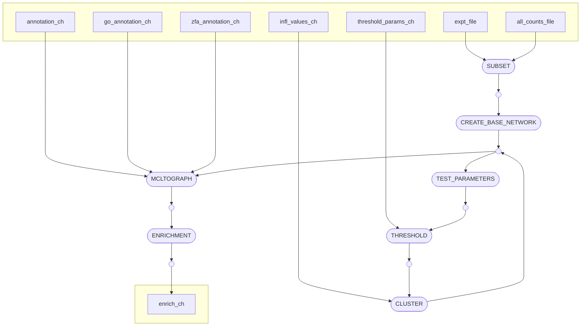

```mermaid
flowchart TB
    subgraph " "
    v0["expt_file"]
    v1["all_counts_file"]
    v12["threshold_params_ch"]
    v16["infl_values_ch"]
    v22["annotation_ch"]
    v23["go_annotation_ch"]
    v24["zfa_annotation_ch"]
    end
    v2([SUBSET])
    v5([CREATE_BASE_NETWORK])
    v9([TEST_PARAMETERS])
    v13([THRESHOLD])
    v17([CLUSTER])
    v25([MCLTOGRAPH])
    v28([ENRICHMENT])
    subgraph " "
    v30["enrich_ch"]
    end
    v3(( ))
    v6(( ))
    v10(( ))
    v14(( ))
    v26(( ))
    v29(( ))
    v0 --> v2
    v1 --> v2
    v2 --> v3
    v3 --> v5
    v5 --> v6
    v6 --> v9
    v9 --> v10
    v12 --> v13
    v10 --> v13
    v13 --> v14
    v16 --> v17
    v14 --> v17
    v17 --> v6
    v22 --> v25
    v23 --> v25
    v24 --> v25
    v6 --> v25
    v25 --> v26
    v26 --> v28
    v28 --> v29
    v29 --> v30
```
