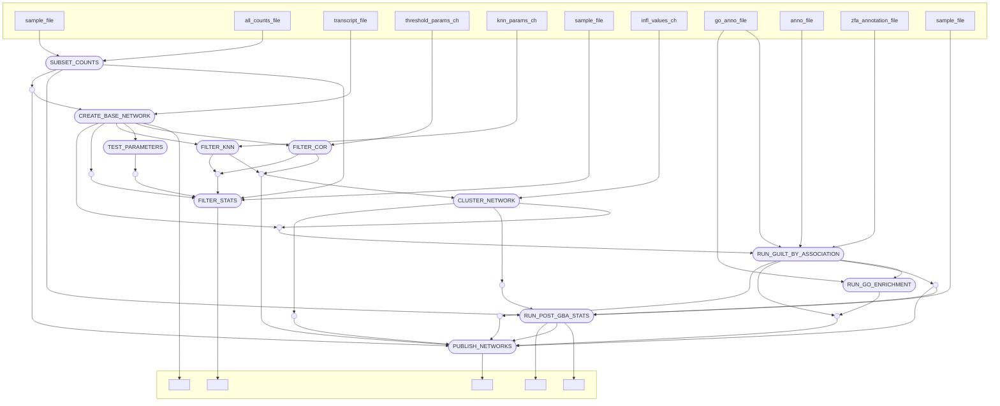

```mermaid
flowchart TB
    subgraph " "
    v0["sample_file"]
    v1["all_counts_file"]
    v8["transcript_file"]
    v12["threshold_params_ch"]
    v14["knn_params_ch"]
    v21["sample_file"]
    v24["infl_values_ch"]
    v27["go_anno_file"]
    v28["anno_file"]
    v29["zfa_annotation_file"]
    v33["sample_file"]
    end
    v2([SUBSET_COUNTS])
    v9([CREATE_BASE_NETWORK])
    subgraph " "
    v10[" "]
    v23[" "]
    v35[" "]
    v36[" "]
    v52[" "]
    end
    v11([TEST_PARAMETERS])
    v13([FILTER_COR])
    v15([FILTER_KNN])
    v22([FILTER_STATS])
    v25([CLUSTER_NETWORK])
    v30([RUN_GUILT_BY_ASSOCIATION])
    v34([RUN_POST_GBA_STATS])
    v37([RUN_GO_ENRICHMENT])
    v51([PUBLISH_NETWORKS])
    v3(( ))
    v16(( ))
    v17(( ))
    v19(( ))
    v20(( ))
    v26(( ))
    v31(( ))
    v32(( ))
    v40(( ))
    v42(( ))
    v49(( ))
    v0 --> v2
    v1 --> v2
    v2 --> v22
    v2 --> v34
    v2 --> v3
    v8 --> v9
    v3 --> v9
    v9 --> v10
    v9 --> v13
    v9 --> v11
    v9 --> v15
    v9 --> v19
    v9 --> v26
    v11 --> v20
    v12 --> v13
    v13 --> v16
    v13 --> v17
    v14 --> v15
    v15 --> v16
    v15 --> v17
    v21 --> v22
    v17 --> v22
    v19 --> v22
    v20 --> v22
    v22 --> v23
    v24 --> v25
    v16 --> v25
    v25 --> v26
    v25 --> v32
    v25 --> v40
    v27 --> v30
    v27 --> v37
    v28 --> v30
    v29 --> v30
    v26 --> v30
    v30 --> v37
    v30 --> v31
    v30 --> v42
    v30 --> v49
    v33 --> v34
    v31 --> v34
    v32 --> v34
    v34 --> v36
    v34 --> v51
    v34 --> v35
    v37 --> v42
    v3 --> v51
    v16 --> v51
    v31 --> v51
    v40 --> v51
    v42 --> v51
    v49 --> v51
    v51 --> v52
```
